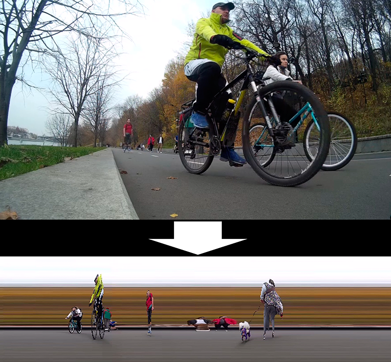
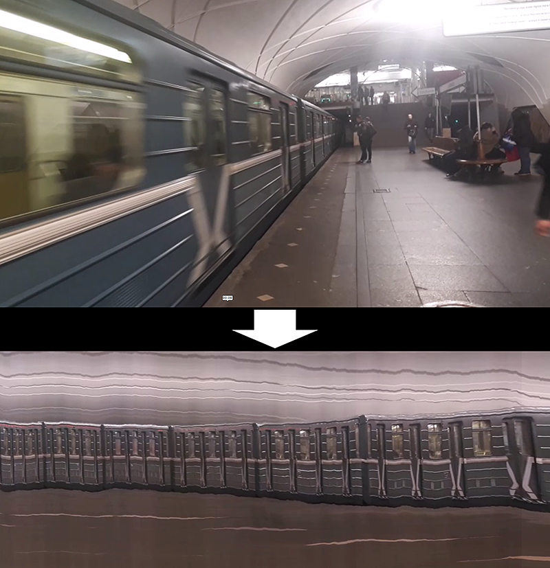

# TimeWarp
Simple video processing scripts for swapping temporal and spatial dimensions.

- timeWarp.py: The main script;
- video_cut.py: The helper script for cutting and resizinf source videos;

See in-scripts comments for usage details.

(Video link will be added later.)

Sample shots:

